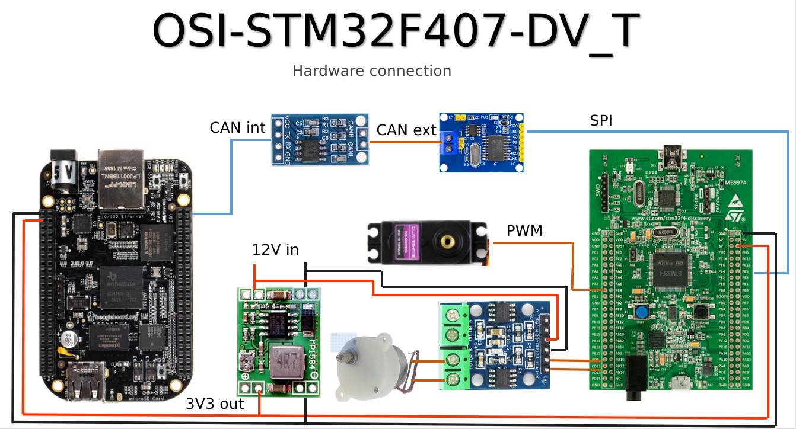

# System Requirement description for the OSI-STM32F407-DB_T

=============== SysRS start ==============
## Acronyms
SBC -> single board computer

BBB -> BeagleBone Black SBC 

OSI-STM32F407-DB_T -> OneSideImplementation on a STM32F407 DiscoveryBoard as Target platform

STM32-DM -> STM32F4xx drive module

FLW -> front left wheel

RLW -> rear left wheel

FRW -> front right wheel

RRW -> rear right wheel

MLW -> mid left wheel

MRW -> right left wheel

## Table of contents
 - [Project goals](#project-goals)
 - [System description](#system-description)
 - [Hardware prerequisite](#hardware-prerequisite)
 - [Hardware Blocks](#hardware-blocks)
 - [Software Function Blocks](#software-function-blocks)

## Project goals

OSI-STM32F407-DB_T project is the initial design to test the communication between the BBB as master controller with the STM32-DM.
This implementation should be define the resources for a later break down this design in a small BlackPill like design.    

## System description

The BBB act in to this platform as a host computer that plan/dispatch/sense the drive units that are attached to it. We start here with only one steering/drive module. 

### Hardware related

* ### Detection of position and function

    three hardware jumper set the position and the function for a drive module
    
    all jumper has a pulldown config as default

        jumper 1 set the left/right of the wheel: 
        0 for left, 1 for right 

        jumper 2 set the front/rear position of the wheel: 
        0 for front, 1 for rear

        jumper 3 set the flag for the middle wheel of the rover:
        0 for don't care, 1 for flag as middle wheel
    
    as a example -> a FLW drive module will have set code #0

        jumper 1 -> not set ; jumper 2 -> not set ; jumper 3 -> not set

    as a example -> a MRW drive module will have set code #05

        jumper 1 -> set ; jumper 2 -> set ; jumper 3 -> set

### Software related

* ### Drive module codes

    Derive from the jumper settings a variable (drive_name) with the name of the drive module (FLW, MLW, RLW, FRW, MRW, RRW) will be hold to use the right software module for the drive 
    the codes for the drive modules comes from the jumper settings (ref -> [Position/Function-Jumper](#detection-of-position-and-function))

    | FLW | MLW | RLW | FRW | MRW | RRW |
    |:---:|:---:|:---:|:---:|:---:|:---:|
    | #0  | #4  | #2  | #1  | #5  | #3  |

## Hardware prerequisite

There are 5 PCB's are involved:
### 1x BeagleBone Black C1.2
We will use this board in the latest step of the implementation with the CAN communication between the BBB and the STM32 dev board, in earlier stages we will implement also the CAN communication with loopback and extern devices
### 1x STM32F407 Discovery Board
this board will use as a development platform to define function blocks for motor/steering/distance measurement and CAN communication.
Also to see what amount of flash and RAM usage consumption is needed to implement later a module based on the BlackPill dev board.
### 1x MCP2515 CAN controller board
this MCP2515 board will connect with the STM32 disco board to establish the CAN communication.
### 1x TJA1050 CAN transceiver board
this TJA1050 transceiver board will connect with the BBB to establish the CAN communication. It's can be a modified MCP2515 board

## Hardware Blocks

In the picture below you se a rough wiring between the boards.

## Software Function Blocks

xxx
 

### NOTES
In case of any requirement update we will update the document and inform you.  

### Contacts
You contact detail goes here  

<i> =============== SysRS End ============== </i>

