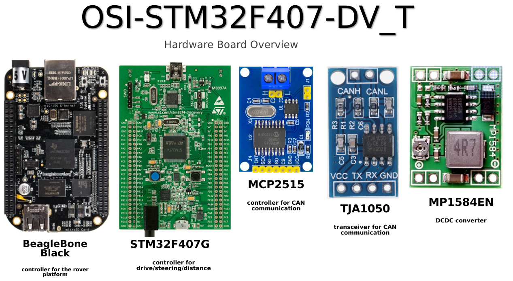

# System Requirement description for the OSI-STM32F407-DB_T

<i> =============== SysRS start ============== </i>

## Table of contents
 - Project goals
 - System description
 - Hardware prerequisit
 - Hardware Blocks
 - Function Blocks

## Project goals

OSI-STM32F407-DB_T project is the preview design to test the communication between the BeagleBone Black as master controller with the STM32 drive modules.
This implementation should be define the resources for a later break this design in a small BlackPill like implementation.    

## System description

xxxx  

## Hardware prerequisit

There are 5 PCB's are involved:
### 1x BeagleBone Black C1.2
will use in the step at the CAN communication will be established after loopback and external test are successful.
### 1x STM32F407 Discovery Board
this board will use a s a development platform to define funktionblocks and test the STM32 side for motor/steering and CAN communication.
Also to see the flash and RAM usage to implement later a module based on the BlackPill dev board.
### 1x MCP2515 CAN controller board
this MCP2515 board will connect with the STM32 disco baod to establish the CAN communication.
### 1x TJA1050 CAN transceiver board
this TJA1050 transceiver board will connect with the BBB to establish the CAN communication. It's can be a modified MCP2515 board

## Hardware Blocks

xxx 

## Function Blocks

xxx
 

### NOTES
In case of any requirement update we will update the document and inform you.  

### Contacts
You contact detail goes here  

<i> =============== SysRS End ============== </i>

